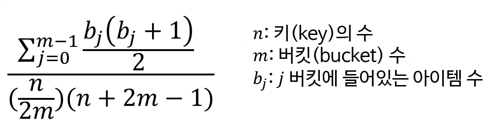

# 4. 해시 알고리즘

다양한 해시 알고리즘의 용도
- 해시(hash)는 컴퓨터 공학에서 매우 근본이 되는 알고리즘 중 하나

해시 함수의 정의
- 임의의 크기를 가진 값을 고정 크기의 값에 대응시키는 함수
- 수학에서의 함수의 정의도 만족해야 함
- 입력값이 같으면 언제나 출력값도 같아야 함(결정론적 작동)

분류
- (비암호학적) 해시 함수
- 함호학적 해시 함수

- 체크섬(검사합, checksum)
- 순환 중복 검사(cyclic redundancy check, CRC)

속성
- 효율성
- 균일성

## 균일성
- 해시 함수의 출력값이 고르게 분포될수록 균일성이 높음
- 흔히 좋은 해시 함수는 균일성이 높아야 한다
    - 출력 범위 안의 모든 값들이 동일한 확률로 나와야 함(균등 분포)
    - 해시 충돌이 적어 O(1) 해시 테이블을 기대할 수 잇음
- 완벽한 해시 함수 : 해시 충돌이 전혀 없는 함수

### 균일성의 측정
- 카이제곱 검정을 이용
  
- 결과 : 0.95 ~ 1.05 사이면 균일한 분포를 가진 해시 함수
- 해시값이 덜 중복되게 버킷 수를 정할 것(소수 사용)
- 완벽한 '눈사태'가 나도록 해시 함수를 설계할 것
    - 입력값이 약간만 바뀌어도 출력값이 굉장히 많이 바뀌는 것
    - 엄격한 눈사태 기준(strict avalanche criterion, SAV)
        - 입력값에서 1비트를 뒤집으면 출력값의 각 비트가 뒤집힐 확률이 50%
        - 이 기준을 충족하는 해시 함수는 분포가 균일할 가능성이 매우 높음
    
