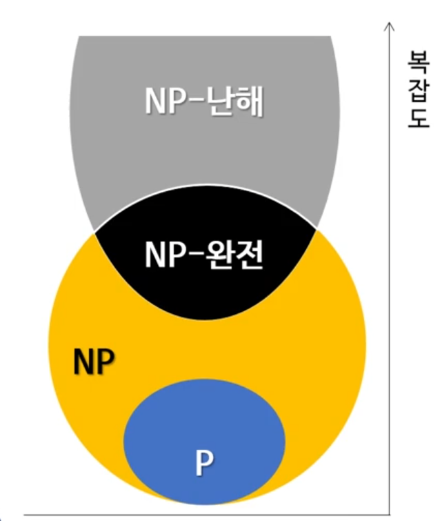

# 2. 재귀함수, 주먹구구식 알고리즘, 이진 탐색

## 재귀함수
간단한 예) 피보나치 수열
- Fn = Fn-1 + Fn-2, (n > 1)

<pre>
* 재귀 함수
public int fibonacciRecursive(int number){
    if(number <= 1) return number;

    return fibonacciRecursive(number - 2)
            + fibonacciRecursive(number - 1);
}
</pre>

<pre>
* 반복문
public int fibonacciRecursive(int number){
    if(number <= 1) return number;

    int fib = 1;
    int prev = 1;
    for(int i = 2; i < number; i++) {
        int temp = fib;
        fib += prev;
        prev = temp;
    }

    return fib;
}
</pre>

- 장점
    - 가독성이 좋음
    - 코드가 짧음
    - 각 단계의 변수 상태가 저장
    - 코드 검증 쉬움
- 단점
    - 분석 / 설계가 비직관적
    - 논리에 대한 믿음 필요
    - 스택 오버플로 발생 가능
    - 함수 호출에 따른 과부하
    
### 꼬리 호출(tail call)
- 함수 코드 제일 마지막에서 다른 함수를 호출하는 경우
- 그 후 실행 명령어가 없음

<pre>
public int calculateSignature(int[] data, int multiplier){
    int[] tempData = new int[data.length];
    for(int i = 0; i < data.length; i++){
        tempData[i] = data[i] * multiplier;
    }
    return accumulate(tempData);
}
</pre>

### 꼬리 호출과 스택 프레임
- 스택 프레임이 존재하는 이유
    - 함수에서 사용 중인 변수 값을 유지하기 위해
    - 타 함수 호출 후 반환되면 스택에 저장했던 값을 되돌려 사용
- 꼬리 호출의 경우는 타 함수로부터 반환 후 더 이상 연산이 없음
- 따라서... 스택 프레임에 저장해 놓은 변수 값을 재사용하지 않음
- 이런 경우 컴파일러가 스택 프레임을 따로 안 만드는 최적화를 하기도 함
    - 꼬리 호출 제거(tail call elimination)
    - 꼬리 호출 최적화(tail call optimization)
    - 언어따라 다름

### 꼬리 재귀
- 꼬리 호출의 특수한 경우
- 마지막에 호출하는 함수(꼬리 호출)가 자기 자신(재귀)
- 꼬리 호출과 똑같은 최적화가 적용됨

<pre>
ex) 팩토리얼 재귀 함수
int factorialRecursive(int n){
    if(n <= 1) return 1;

    return n * factorialRecursive(n - 1);
}
</pre>
** 꼬리 재귀 : Nope

Why? 마지막 함수 호출 후 종료가 아닌 변수 n을 사용하기 때문에 꼬리 재귀가 아니다.

<pre>
팩토리얼 꼬리 재귀 함수
int factorial(int n){
    return factorialRecursive(n, 1);
}

int factorialRecursive(int n, int fac){
    if(n <= 1) return fac;

    return factorialRecursive(n - 1, n * fac);
}
</pre>
** 꼬리 재귀 : Yep

Why? factorialRecursive(n - 1, n * fac); 이 코드가 마지막 실행이기 때문에 꼬리 재귀 함수다.

- 보통 꼬리 재귀 함수가 덜 직관적
- 그럼에도 작성 이유는 최적화 때문(자바는 지원 X)
- 꼬리 재귀는 반복문으로 쉽게 변경 가능!

## 주먹구구식(brute-force) 알고리즘
- 모든 경우의 수를 시도하는 알고리즘
  - 최소 O(N)
- 효율성을 고려하지 않음

### 간단한 주먹구구식 알고리즘의 예와 시간 복잡도
- 완전(exhaustive) 검색
- 배열에서 평균 구하기
- 배열에서 최솟값, 최댓값 찾기
- 그 외 다수
- 모두 O(N)

### 시간 복잡도
- O(N) 보다 시간 복잡도가 높은 알고리즘이 많음
- O(N^3) 정도부터 최적화 고려
- 컴퓨터에서 실행하기에는 너무 느린 알고리즘들도 많음

## P vs NP

### P 분류(P class)
- 판정 문제들을 분류하는 방법 중 하나
  - 판정 문제 : 입력 값에 대해 예/아니고 답을 내릴 수 있는 문제
- 튜링 기계에서 다항식 시간 안에 풀 수 잇는 모든 문제를 포함
  - 튜링 기계 : 무언가를 계산하는 기계를 대표하는 가상의 장치
    - 일반적인 컴퓨터 알고리즘 수행
    - 어떤 명령어 실행 뒤, 다음 실행할 명령어가 확정됨
    - 코어 하나에 명령어를 순서대로 실행한다 생각
    - 코어 하나에서 실행되는 다항식 시간 알고리즘이 있는 문제는 P
  
### NP 분류
- NP : 비결정적 다항식 시간(Nondeterministic Polynomial Time)
  - 비결정적 튜링 기계
    - 어떤 명령어 실행 뒤, 다음 실행할 명령어가 확정되지 않음
    - 여러 개의 다음 명령어를 병렬적으로 실행하는 기계
  
<pre>
P or NP

public static boolean hasGreater(int[] nums, int k) {
    for (int i = 0; i < nums.length; ++i) {
        if (nums[i] > k) {
            return true;
        }
    }
    return false;
}
</pre>

** answer : P 이자 NP

Why? 다항식 시간안에 풀 수 있는 문제(한 코어에서 다항식 시간 안에 풀 수 있다면 병렬적으로도 마찬가지)

NP를 다항식 시간안에 검증할 수 있다?
- 검증 : 답이 맞는지 확인함
- 답 : 각 분기마다 따라야 하는 가지들
- 다음 둘을 비교
- 같으면 검증 완료

따라서...
- 둘 사이의 판단 기준이 아예 다름
  - NP가 not P가 아님
- 사실 모든 P 문제는 NP

### NP-완전(NP-complete, NPC) 문제
- NP 문제 중 일부
- 모든 NP 문제들은 NP-완전 문제로 환원 가능
  - 다항 시간 안에 가능
  
#### NP-완전 문제
- 외판원 문제(판정 버전)
  - 어떤 정해진 길이 L (조건)
  - 길이를 넘지 않는 경로가 있는지 판정
- 배낭 문제
  - 크기와 가격이 다른 여러 물품 존재
  - 값어치가 최대가 되도록 물건 넣기
  - 배낭 크기 제한
  - 판정 버전 : 최소 어떤 값어치 V만큼 넣을 수 있는가?
- 해법
  - 동적 계획법
  - 그리디 알고리즘
  
### NP-난해(NP-hard) 문제
- 최소 NP-완전 문제만큼 어려운 문제
- NP-완전 문제는 모두 NP-난해 문제
- NP가 아닌 문제도 있음
  - 즉, 다항식 시간 안에 답 검증이 불가능

## 이진 탐색
- 데이터의 성질 : 정렬되어 있음
- 시간 복잡도 : O(log n)
- 분할 정복(divide-and-conquer) 알고리즘 중 하나
- 재귀 함수로 쉽게 작성 가능
<pre>
//    l : 시작점, r : 끝점
public static int binarySearchRecursive(int nums[], int l, int r, int value){
    count++;
    int m = (l + r) / 2;
    if(nums[m] == value) return m;

    return value < nums[m] ? binarySearchRecursive(nums, l, m - 1, value) : binarySearchRecursive(nums, m + 1, r, value);
}
</pre>

### 정렬 후 이진 탐색 vs 선형 탐색
- 배열이 안 바뀌는 경우
  - 탐색할 일이 많은 경우
    - 정렬 한 번 후, 이진 탐색 여러 번
    - O(정렬) + O(log n) * x
  - 탐색을 한 번만 할 경우
    - 선형 탐색
    - O(n)
- 배열이 바뀌는 경우
  - 요소를 삽입하는 경우만 문제
  - 보통 선형 탐색 사용
  - 이진 탐색을 사용하려면?
    - 탐색 전에 배열 정렬
    - 선형 탐색보다 느릴 수 있음

