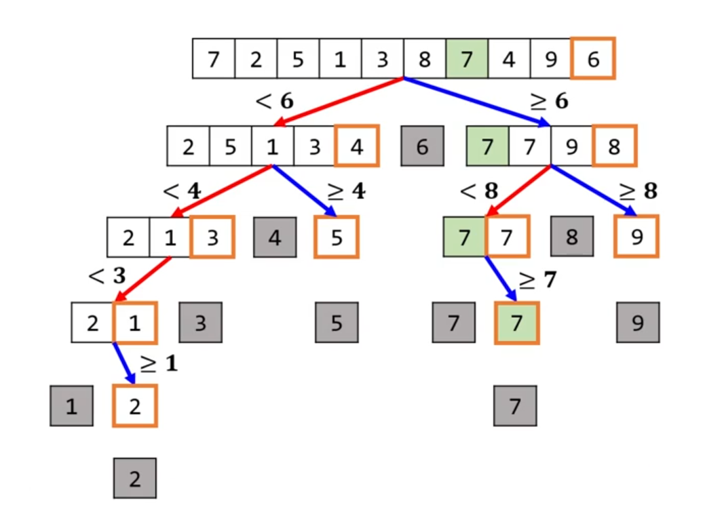

# 3. 정렬 알고리즘

## 정렬 알고리즘의 안정성
- 똑같은 키를 가진 데이터들의 순서가 바뀌지 않느냐 여부
<pre>
int nums[] = {1, 3, 4, 4, 1(*)}

* 안정적인 정렬
int nums[] = {1, 1(*), 3, 4, 4}

* 불안정적인 정렬
int nums[] = {1(*), 1, 3, 4, 4}
</pre>

## 대표적인 정렬 알고리즘
- **버블 정렬**
- **선택 정렬**
- 삽입 정렬
- 퀵 정렬
- 병합 정렬
- 힙 정렬

### 정렬 알고리즘 비교
|알고리즘|평균|최악|메모리|안정성|
|:-------|:---:|:---:|:-----:|:-----:|
|버블|O(N^2)|O(N^2)|O(1)|O|
|선택|O(N^2)|O(N^2)|O(1)|X|
|삽입|O(N^2)|O(N^2)|O(1)|O|
|**퀵**|O(N log n)|O(N^2)|O(log n)|X|
|병합|O(N log n)|O(N log n)|O(N)|O|
|힙|O(N log n)|O(N log n)|O(1)|X|

- 기본 : 퀵 정렬
- 간단히 구현 할 때 : 버블 정렬
- 어떤 경우에도 느려지면 안될 때 : 병합 또는 힙 정렬
- 특수항 상황

## 버블 정렬
|알고리즘|평균|최악|메모리|안정성|
|:-------|:---:|:---:|:-----:|:-----:|
|버블|O(N^2)|O(N^2)|O(1)|O|
- 가장 간단한 정렬 알고리즘 중 하나
- 이웃 요소 둘을 비교해서 올바른 순서로 고치는 과정을 반복

### 버블 정렬의 시간 복잡도
- 목록을 훑는 횟수는 총 몇번 ? N -1 번
- 한번 훑을 때
  - 가장 많이 방문했던 요소 수는 ? N - 1번(1회차)
  - 가장 적게 방문했던 요소 수는 ? 1(6회차)
  - 평균적으로 방문했던 요소 수는 ? N / 2
- 시간 복잡도 : O(N^2)

### 버블 정렬의 공간 복잡도
- 공간 복잡도 : O(1)

## 선택 정렬
|알고리즘|평균|최악|메모리|안정성|
|:-------|:---:|:---:|:-----:|:-----:|
|선택|O(N^2)|O(N^2)|O(1)|X|

- 목록을 총 N - 1번 훑으면서 다음 과정을 반복
  - 첫 번째는 요소 0부터 훑으면서 최솟값을 찾아 요소0과 교환
  - 두 번째는 요소 1부터 훑으면서 최솟값을 찾아 요소1과 교환
  - ... 반복

### 선택 정렬의 시간/공간 복잡도
- 시간 복잡도 : O(N^2)
- 공간 복잡도 : O(1)
- 안정성 보장 안됨

## 삽입 정렬
|알고리즘|평균|최악|메모리|안정성|
|:-------|:---:|:---:|:-----:|:-----:|
|삽입|O(N^2)|O(N^2)|O(1)|O|

- 목록을 차례대로 훑으면서 다음 과정을 반복
  - 현재 위치 요소를 뽑음
  - 이걸 과거 방문했던 요소들 중에 어디 사이에 넣어야 정렬이 유지될지 판단
  - 그 위치에 삽입
  - 삽입으로 인해 다른 요소들을 오른쪽으로 밀어야(shift) 할 수도 있음
- 외부 반복문의 반복 횟수는 고정
  - O(N)
  
## 퀵 정렬
|알고리즘|평균|최악|메모리|안정성|
|:-------|:---:|:---:|:-----:|:-----:|
|**퀵**|O(N log n)|O(N^2)|O(log n)|X|

- 실무에서 가장 많이 사용
  - 일반적/범용적으로 가장 빠름
- 진정한 분할 정복 알고리즘
  - 모든 요소를 방문함(decrease-and-conquer와의 차이)
- 어떤 값(pivot)을 기준으로 목록을 하위 목록으로 2개로 나눔

### 퀵 정렬의 공간 복잡도
- 재귀적으로 함수를 호출
- 실제 원본 배열을 고침 : O(1)
- 함수 호출 깊이 만큼 스택 메모리 사용
  - O(log n)
  - 스택 메모리라 할당/해제가 매우 빠름
  
## 병합 정렬
|알고리즘|평균|최악|메모리|안정성|
|:-------|:---:|:---:|:-----:|:-----:|
|병합|O(N log n)|O(N log n)|O(N)|O|

1. 입력 배열을 재귀적으로 반씩 나눠 요소수가 1인 배열들을 만듦
  - 요소수가 1이니 정렬된 배열
  - 정확히 반씩 나누니 재귀 깊이는 O(log N)
2. 재귀 반대 방향으로 배열을 계속 합침
  - 이때 정렬된 상태를 유지
  - 각 재귀 단계마다 방문하는 요소수는 O(N)
3. 제일 상위 단계까지 합치면 정렬

## 힙 정렬
|알고리즘|평균|최악|메모리|안정성|
|:-------|:---:|:---:|:-----:|:-----:|
|힙|O(N log n)|O(N log n)|O(1)|X|

- 힙은 트리에 기반한 자료 구조
  - 우선순위 큐의 효율적인 정렬 알고리즘
  
