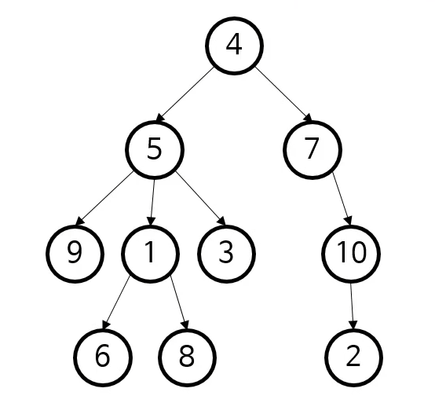
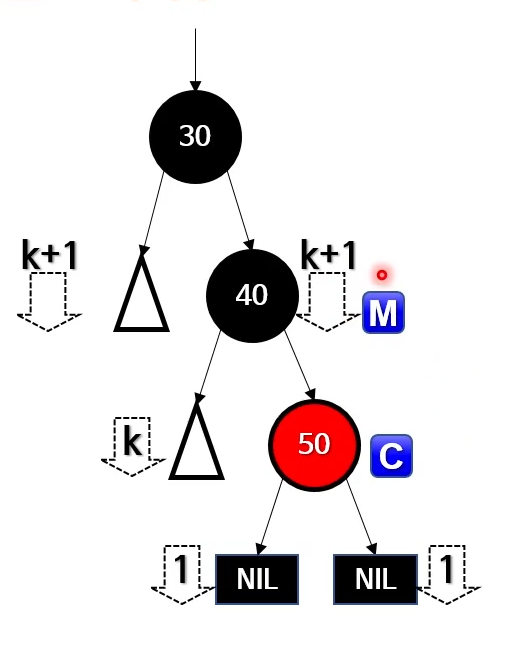

# 6. 트리, 이진 탐색 트리, 레드-블랙 트리

## 트리
- 매우 널리 사용하는 자료구조 중 하나
- 나무(tree)의 계층적 구조를 표현

트리 관련 용어
- 노드(node) : 실제로 저장하는 데이터
- 루트(root)노드 : 최상위에 위치한 데이터
    - 시작 노드
    - 모든 노드와 직간접적으로 연결됨
- 리프(leaf)노드 : 마지막에 위치한 데이터들
    - 더 이상 가지를 치지 않음
- 부모-자식 : 연결된 노드들 간의 상대적 관계
    - 자식은 없을 수도, 많이 있을 수도
- 깊이(depth) : 노드 -> 루트 경로의 길이
- 높이(height) : 노드 -> 리프 경로의 최대 길이
- 하위트리(subtree) : 어떤 노드 아래의 모든 것을 포함하는 트리
    - 재귀적 : 하위 트리 그 자체가 트리
    
#### 트리는 재귀적 자료구조


#### 트리의 저장법
- 트리의 속성
    1. 부모와 자식 모두 노드
    2. 부모 : 자식 = 1 : 다수
    3. 자식은 언제나 부모로부터 가지를 침
- 따라서 부모가 자식을 참조하는 방식이 가장 직관적

```
public class Node{
    public int data;
    public ArrayList<Node> children;
}

if 자식이 최대 둘인 트리의 저장법(이진 트리)
public class Node{
    public int data;
    public Node left;
    public Node right;
}
```

#### 트리의 용도
- 계층적 데이터를 표현
    - HTML이나 XML의 문서 개체 모델(DOM)을 표현
    - JSON이나 YAML 처리 시 계층 관계를 표현
    - 프로그래밍 언어를 표현하는 추상 구문 트리(abstract syntax tree)
    - 인간 언어를 표현하는 파싱 트리(parsing tree)
- 검색 트리를 통해 효율적인 검색 알고리즘 구현 가능
- 그외 다수

## 이진 탐색 트리(BST)
- 자식이 최대 둘
    - 왼쪽/오른쪽 자식
- 무언가 계층적(재귀적)으로 이분해 나갈때 적합
- 기준(규칙) 추가

### 정렬된 배열 vs 이진 탐색 트리
- 정렬된 배열
    - 보통 이진 탐색 전에 정렬을 함
    - 새로 추가된 데이터는 비정렬 상태
    - 탐색 시간 : O(log n)
    - 삽입 및 삭제 : O(n)
    - 매우 간단한 데이터 구조
    - 메모리의 한 덩어리
- 이진 탐색 트리
    - 탐색 전에 따로 정렬 불필요
    - 데이터 추가 시 정렬된 위치에 추가
    - 탐색 시간 : O(log n)
    - 평균 삽입/삭제 시간 : O(log n)
    - 연결 리스트 이상 복잡한 데이터 구조
    - 보통 여러 메모리 덩어리
    
### BST 탐색
- 기본적으로 이진 탐색과 동일
    - 분할 정복(재귀적)
- 차이점
    - 각 노드마다 두 하위 트리로 이분됨
- 하위 트리로 내려갈 때마다
    - 검색 공간이 절반씩 줄어듦
    - O(log n)
- 최악 : O(n)
    - 사실상 연결 리스트
    
### BST 삽입 정리
- 새로운 노드를 받아줄 수 있는 부모 노드를 찾음 O(log n)
  - 트리를 내려가는 방법은 탐색과 같음
  - 새로운 노드를 받아줄 수 있는 부모란?
    - 오른쪽 하위 트리로 내려가야 하는데 오른쪽 자식이 없는 부모
    - 왼쪽 하위 트리로 내려가야 하는데 왼쪽 자식이 없는 부모
- 그 후, 거기에 자식으로 추가 O(1)

### BST 삭제
- BST는 정렬된 배열과 개념상 같음
  -중위 순회를 하면 정렬된 배열이 나옴
- 따라서 노드를 삭제한 뒤에도 올바른 BST를 유지하려면?
  - 정렬된 배열에서 값을 하나 삭제하듯이 처리
- 트리에서 뭔가를 지울 때 언제나 리프를 지움
  - 오른쪽 하위 트리에서 최솟값(제일 왼쪽 리프 : in-order successor)
  - 왼쪽 하위 트레에서 최댓값(제일 오른쪽 리프 : in-order predecessor)

#### BST 삭제 전략
1. 지울 값을 가지고 있는 노드를 찾음
2. 그 바로 전 값을 가진 노드를 찾음(or 다음 값)
  - 왼쪽 하위 트리의 제일 오른쪽 리프
3. 두 값을 교환165
4. 리프 노드를 삭제

### 트리 순회(tree traversal)
- 대표적인 3가지 트리 순회법
  - 전위(pre-order) 순회
  - 중위(in-order) 순회
  - 후위(post-order) 순회
- 하위 트리와 비교했을 때 현재 노드의 방문 순서
  - 중위 : 왼족 하위 트리 -> 현재 노드 -> 오른쪽 하위 트리
  - 전위 : 현재 노드 -> 왼쪽 하위 트리 -> 오른쪽 하위 트리
  - 후위 : 왼쪽 하위 트리 -> 오른쪽 하위 트리 -> 현재 노드
  
<pre>
public static void traverseInorder(Node node) {
    if(node == null) return;
    
    traverseInorder(node.left);
    System.out.println(node.data);
    traverseInorder(node.right);
}
</pre>

#### 전위 순회의 용도
- 트리복사
  - 부모가 있어야 자식도 추가할 수 있음
  - 따라서 전위 순회가 적합
    - 부모를 먼저 나열
    - 다른 순회는 부모가 중간 혹은 마지막
  - 물론 다른 순회로도 복사는 가능
- 수식의 전위 표기법
  - 수식은 보통 중위 표기법(infix notation)을 사용
    - 괄호로 우선 순위를 정해줄 수 있음
    - 오른쪽 트리를 중위 순회하면 다음 수식이 나옴
    - A * (B - C) - (D + E)
  - 전위 표기법(prefix notation)
    - 폴란드 표기법이라고도 불림
    - 연산자/괄호의 우선 순위가 없음(읽는 순서대로)
  
#### 후위 순회
- 후위 표기법(postfix notation)
  - 역 폴란드 표기법이라고도 불림
  
## 레드-블랙 트리
- 각 노드가 레드 혹은 블랙
  - 노드에 저장하는 데이터가 아님
  - 그냥 1비트짜리 추가 정보
- 스스로 균형을 잡는(self-balancing) 트리
  - 트리 높이를 최소로 보장
  - 균형을 잡는 시점은 삽입과 삭제 시
  - 그 외 연산은 BST와 동일
  
### 특성
- 노드는 레드 또는 블랙이다
- 루트 노드는 블랙이다
- 모든 리프 노드(NIL)는 블랙이다
- 레드 노드의 자식은 모두 블랙이다
- 어떤 노드와 리프 사이에 있는 블랙 노드 수는 동일하다(블랙 높이)
  - 블랙 노드에만 있는 제약
  - 이를 통해 블랙과 레드 노드 수의 균형을 맞춤
  - 이걸 위해 삽입/삭제 시 트리를 재배치하거나 노드의 색을 바꾸기도 함
  
이런 특성의 영향
- 리프 노드는 데이터를 담지 않음(NIL)
- 다음과 같은 용어가 탄생
  - 블랙 깊이 : 루트와 어떤 노드 사이에 있는 블랙 노드 수
  - 블랙 높이 : 어떤 노드와 리프 사이에 있는 블랙 수
- 가장 큰 리프 깊이가 가장 작은 것의 2배를 넘지 않음
  - 레드-블랙 트리가 보장하는 핵심 특성
  - 이진 트리 연산 시간이 O(N)이 되는 최악의 경우를 방지 : O(log n)을 보장
  
### 레드-블랙 트리의 연산
- 탐색 : 이진 탐색 트리와 같음
  - 단, O(log n) 보장
- 삽입과 삭제
  - 일단 무작정 삽입 혹은 삭제(특성이 망가질 수 있음)
  - 그 후, 망가진 특성을 고치려 트리의 구조를 재배치(회전) 혹은 노드 색을 바꿈
  - 완벽하진 않지만 탐색 시간 O(log n)을 보장할 정도의 균형
  - 모두 O(log n)
    - 삽입 또는 삭제 O(log n)
    - 트리 회전: O(1)
    - 색 바꾸기: O(1)
  
### 일반적인 레드-블랙 트리 삽입
- BST와 똑같이 삽입
  - 단, 새로 삽입하는 노드는 언제나 레드
  - 언제나 리프에 추가되니 아래 연산이 간단해짐
- 레드-블랙 트리의 조건을 만족하도록 재귀적으로 고침
  - 재귀 방향 : 리프로부터 위로 올라가면서
  - 고칠 때 사용하는 기법은 다음 두가지
    - 트리 회전
    - 색깔 바꾸기
  - 총 4가지 상황(패턴)에 따라 트리 회전, 색깔 바꾸기 기법을 다르게 적용
  
### 레드-블랙 트리 삽입의 시작 복잡도
- 노드를 리프에 삽입 : O(log n)
- 새 노드 색을 레드로 칠함 : O(1)
- 망가진 레드-블랙 트리의 특성을 고침 : O(log n)
  - 색상 바꾸기 : O(1)
  - 트리 회전 : O(1)
  
#### 레드-블랙 트리 삽입 전략 - case1
- 상황 : 현재 노드 N이 트리의 루트
- 전략 : N을 블랙으로 바꾼다

#### 레드-블랙 트리 삽입 전략 - case2
- 상황 : N의 부모 P가 블랙
- 전략 : 아무것도 안함

#### 레드-블랙 트리 삽입 전략 - case3
- 상황 : P와 삼촌 U가 모두 레드, 조부모 G는 블랙
- 전략 : P, U, G의 색을 바꾼다
- G부터 다시 실행

#### 레드-블랙 트리 삽입 전략 - case4-1
- 상황 : P는 레드, U는 블랙
- 전략 : N이 하위 트리의 안쪽에 있찌 않도록 회전
- 그리고 단계2로 진행

#### 레드-블랙 트리 삽입 전략 - case4-2
- 상황 : 이제 N이 하위 트리의 바깥쪽에 있음
- 전략 : G에서 우회전 후 P와 G의 색을 바꿈

### 레드-블랙 트리의 삭제 방법
- BST에서 삭제하듯이 우선 삭제한다
  - 지우려는 값을 가진 노드를 찾음
  - 교환할 NIL 아닌 노드 M을 찾음
  - 값을 복사해옴(색은 복사 안함)
  - M을 지움
- 조건
  - M은 언제나 오른쪽 하위 트리의 최솟값(또는 왼쪽 하위 트리의 최댓값)
    - M의 왼쪽에 다른 값이 있을 수 없음
    - 오른쪽에는 값이 있을 수 있음
  - 따라서 다음과 같은 자식을 가진 노드를 지우는 문제
    - 자식이 모두 NIL
    - 자식 중 하나만 NIL
  
#### M과 C가 모두 블랙일 때만 문제
- M이 레드면 C는 반드시 블랙
- M이 블랙이고 C가 레드인 경우는?
  - C의 한쪽 자식은 무족건 NIL (BST 삽입 규칙에 따라)
  - C는 다른 쪽 자식이 레드일 순 없음
  - C의 다른 쪽 자식이 NIL 아닌 블랙일 수도 없음
  - C의 자식은 무족건 NIL




