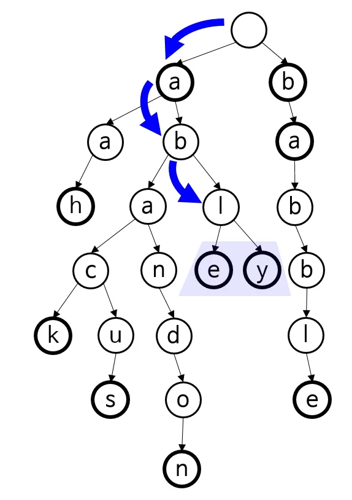
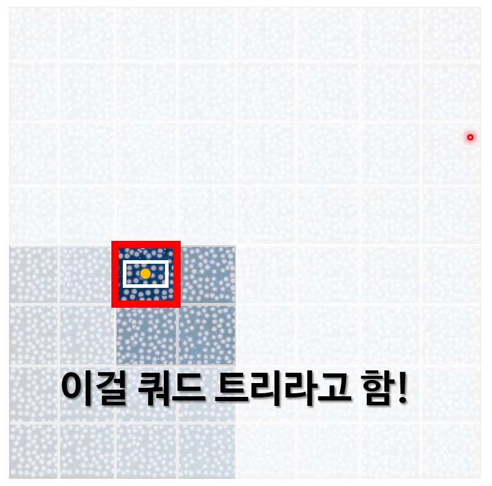

# 7. 트라이, 공간분할 트리

## 트라이(trie)
- 어떤 집합 안에서 특정한 키를 찾을 때 사용
- 키는 문자열인 경우가 보통
- 노드 사이의 연결이 한 글자로 결정됨
  - 키 전부가 아님
- 노드 위치 자체가 키를 정의
  - 노드가 키 전체를 저장하지 않음
  
#### 이진 트리 vs 트라이
이진 트리
- 각 노드의 연결이 키에 따라 결정
- 노드가 그 키를 저장

트라이
- 연결이 키 전부가 아닌 한 글자로 결정
- 노드가 키를 저장하지 않음
- 그 노드 위치 자체가 키를 결정

def)
- 탐색 트리 중 하나
- 어원 : retrieval
    - 원래는 트리라 발음
    - 구분하려고 트라이로 발음
- 다른 이름
    - digital tree
    - prefix tree
  
ex) 자동완성 기능

### 트라이 용도
- 사전 데이터의 저장
  - 용량을 더 차지할 수는 있음
  - 그러나 탐색 속도 향상
- 해시 테이블 대신 사용 가능
  - 충돌이 없음
  - 해시 테이블보다 최악의 경우에 더 빠름 -> O(K)
  - 평균 O(1)이 아님
  - 표현하기 어려운 데이터 형도 있음(예: float)
  
## 공간분할 트리
물체 그리기 요청 방법 1 : 모두 요청
- 모든 물체를 그려달라 함
- 그래픽 카드가 모든 물체를 화면에 투영
  - 화면 밖에 있는 물체는 안 그려짐
  - 안/밖 판단을 하려면 여전히 투영 필요
- 그래픽 프로그래밍에서 종종 병목점

물체 그리기 요청 방법 2 : 적당히 추려서 요청
- 화면에 확실히 안 나올 물체들은 추려버림
  - 경계 상자, 경계 구 등을 이용
- 안 추려진 물체들만 그래픽 카드에 요청
  - 이것만 그래픽 카드가 화면에 투영
- 여전히 모든 물체에 대해 투영 연산
  - 하지만 CPU에서 연산
  - 간단한 모양을 사용

### 쿼드 트리

- 사분 트리라고도 함
- 재귀적으로 2D 공간을 분할
- 각 노드가 4개의 자식을 가짐
  - 왼쪽 위, 오른쪽 위, 왼쪽 아래, 오른쪽 아래
  - 현재 노드를 4개의 하위 사각 영역으로 나눔
- 공간분할 트리

### 옥 트리(octree)
- 재귀적으로 3D 공간을 분할
- 각 노드가 8개 자식을 가짐
  - 쿼드 트리의 4자식 * 앞/뒤
  - 현재 노드를 8개의 하위 상자로 나눔
- 3D 프로그램에 종종 사용
  - ex) 마인크래프트
  - 글로벌 일루미네이션(전역 조명) 효과
  
### 기타 공간분할 트리
- BSP(이진 공간 분할 트리)
- R 트리
- k-d 트리
- ...

