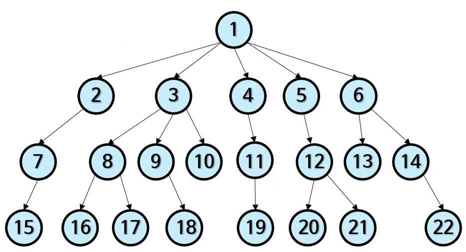
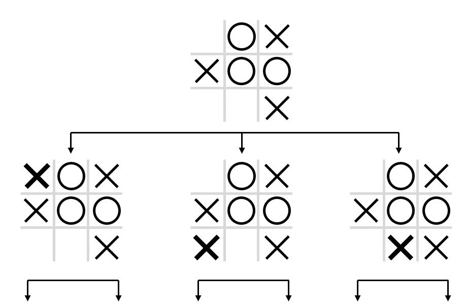
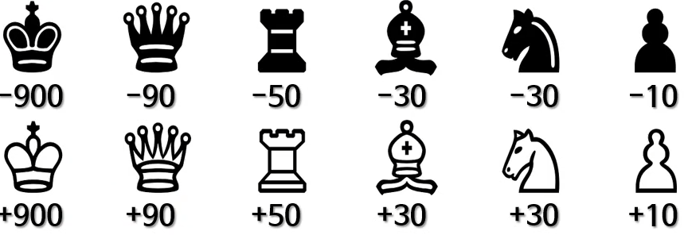

# 8. 깊이 우선 탐색, 너비 우선 탐색, 미니맥스

## 깊이 우선 탐색(DFS)

- "한 우물부터 깊이 판다!"
- 중위 순회와 매우 비슷
    - 따라서 재귀 함수로 쉽게 작성할 수 있음
    - 비 재귀적으로도 가능(스택 자료 구조)
    - 사실 깊이 우선 탐색 기법 중 하나
- 간단한 '미로 탈출하기' 전략

## 너비 우선 탐색(BFS)

- "여러 우물을 동시에 같은 깊이로!"
- 현재 깊이의 이웃 노드들을 우선 방문
  - 어느 한 가지부터 깊게 보지 않음
  - 현재 노드보다 얕은 노드는 모두 방문했음!
- 최단 경로 찾기에 적합

|깊이 우선 탐색(DFS)|너비 우선 탐색(BFS)|
|:-------|:-------|
|자식부터 탐색|이웃부터 탐색|
|관련 자료 구조 : 스택|관련 자료 구조 : 큐|
|**장점**|**장점**|
|재귀 함수 호출로 간단히 구현 가능|언제나 최소 깊이의 결과를 찾음|
|보통 BFS 보다 메모리 사용량이 적음|깊이가 무한인 트리에도 사용 가능|
|캐시 메모리에 좀 더 친화적||
|병렬처리에 더 적합||

### 미리 보기: 그래피와 깊이/너비 우선 탐색
- 그래프
  - 서로 연관 있는 노드의 집합
  - 연관 있는 노드끼리 변(edge)으로 연결
  - 부모/자식 관계를 요하지 않음
- 무방향 그래프
  - 노드 사이에 정해진 방향이 없음
  
## 미니맥스
- 최악의 경우 발생할 수 있는 손실을 최소화 하려는 규칙
- 게임이론, 결정이론, 통계학, 철학 등에서 널리 사용
- 최초의 AI 체스 월드 챔피언 Deep Blue가 사용한 알고리즘
  - 현재 챔피언은 기계학습 알고리즘
  - 여전히 미니맥스에 기초한 체스 AI도 상위권
- 제로섬(zero-sum) 게임의 결정 알고리즘으로 적합
  - n명이 참가하는 제로섬 게임이론에서 시작한 알고리즘
  - 여전히 어떤 제로섬 게임에도 적용하기 적합

### 틱택토 게임
- 2인용 보드 게임
- 내 표식 3개를 한 줄로 연결하면 이김

### 미니맥스 알고리즘의 가정
1. 상대방도 최적의 결정을 내림
  - 상대방도 이기는게 목표
  - 랜덤하게 플레이하지 않음
2. 게임이 순수히 전략적이여야 함
  - 운 같은 요소가 없어야 함
  - 따라서 포커나 부루마블 같은 게임에는 비적합
  - 그러나 운 까지도 고려하는 변형 알고리즘도 있음

#### 틱택토 AI
- 현재 보드 구성을 보고 다음에 돌 놓을 자리를 결정
- 총 게임 진행법은 9! = 362,880개 미만
  - 모든 경우의 수를 고려 가능

    
#### 틱택토에 필요한 전략
- 상대방이 이길 수 있는 보드 구성을 주지 않는다
- 그러나 내가 이길 수 있는 가능성은 열어 둔다
- 상대가 이길 때 : -10, 비길 때 : 0, 내가 이길 때 : +10
- 내 차례 : max, 상대 차례 : min

### 게임 트리를 전부 훑을 수 없는 경우
- 특정 깊이까지만 게임 트리를 만듦
  - 예: 현재부터 깊이 3까지만
  - 3개의 수를 내다보는 것과 마찬가지 이야기
- 마지막 깊이에서 점수를 계산해야 함
  - 확실히 승/패가 결정 안 난 상황
  - 근사치를 구함
  - "현재 보드 상태가 나에게 얼마나 유리한가?"
    - 평가함수 제작
   
#### 체스게임과 미니맥스
- 체스게임 시작 시 모든 경우의 수를 계산하는 건 거의 불가능
  - 경우의 수가 매우 많음
  - 끝나지 않고 무한히 움직이는 경우도 있음
- 깊이를 제한해야함
- 마지막 깊이의 보드에서 점수 계산
- 간단한 점수 계산법
  - 살아 있는 말마다 점수를 가감
  - 킹이 제일 중요한 말
  

