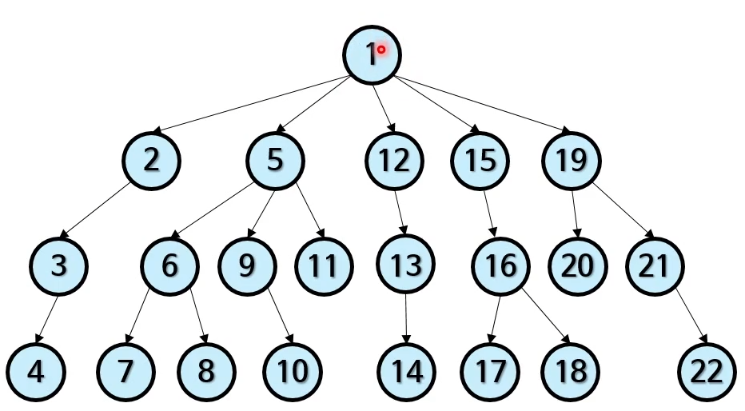

# 8. 깊이 우선 탐색, 너비 우선 탐색, 미니맥스

## 깊이 우선 탐색(DFS)

- "한 우물부터 깊이 판다!"
- 중위 순회와 매우 비슷
    - 따라서 재귀 함수로 쉽게 작성할 수 있음
    - 비 재귀적으로도 가능(스택 자료 구조)
    - 사실 깊이 우선 탐색 기법 중 하나
- 간단한 '미로 탈출하기' 전략

## 너비 우선 탐색(BFS)