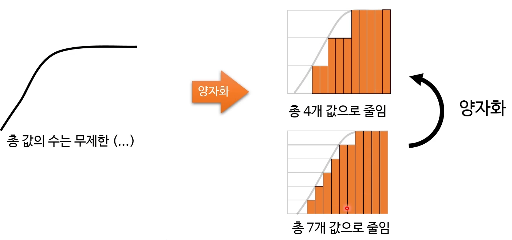

# 9. 동적 계획법, 그리디 알고리즘

## 동적 계획법(dynamic programming, dp)
- 특별한 속성을 가진 복잡한 문제를 푸는 방법
- 복잡한 문제를 그보다 단순한 하위 문제로 나눠서 풂
  - 재귀적
  - 가장 단순한 문제 + 1은 그 다음으로 단순한 문제
  - 이걸 반복하면 원래의 복잡한 문제까지 해결
- 당연히 모든 문제를 이렇게 풀 수는 없음
  - 특별한 속성이 필요
  
#### 배낭(knapsack) 문제
- 크기와 가격이 다른 여러 물품이 있음
- 값어치가 최대가 되도록 물건 넣기
- 당연히 배낭에는 크기 제한이 있음
- 판정 버전은 약한 NP-완전 문제
  - "최소 어떤 값어지 V만큼 넣을 수 있는가?"
  - 의사 다항식 시간 안에 풀 수 있음
- 시간 복잡도 : O(2^n)

### 메모이제이션(memoization)
- 계산 결과를 캐시에 저장해 둔 뒤, 나중에 재사용하는 기법
  - **처음 계산할 때 그 결과를 캐시에 저장**
  - 나중에 동일한 계산을 다시 하는 대신 저장해둔 값을 가져다 씀
  - 값비싼 계산(예: 깊은 재귀 호출)에 적합
  - 최적화 기법 중 하나, 캐싱 기법 중 하나
- 보통 함수가 매개변수에 따라 반환하는 값을 캐싱하는 것을 지칭
- 컴퓨터 프로그래밍에서만 사용하는 용어

```
메모이제이션을 사용한 피보나치 함수
public static int fibonacciRecursive(int number, int[] cache){
  if(number <= 1){
    return number;
  }
  
  if(cache[number] != 0){
    return cache[number];
  }
  
  int ret = fibonacciRecursive(number - 2, cache)
              + fibonacciRecursive(number - 1, cache);
  cache[number] = ret;
  
  return ret;
}
```

### 동적 계획법과 메모이제이션
- 전혀 다른 개념
  - 메모이제이션 : 실행된 결과를 기억해뒀다가 재사용하는 최적화 기법
  - 동적 계획법 : 복잡한 문제를 하위 문제로 쪼개서 재귀적으로 푸는 방법
- 하지만 동적 계획법 = 메모이제이션이라 흔히 오해함
  - 메모이제이션이 동적 계획법에 필수가 아님
  - 동적 계획법의 성능을 향상할 뿐
- 다른 곳에서도 메모이제이션을 사용함

#### top-down 동적 계획법
- 최종적으로 풀려고 하는 복잡한 문제(루트)에서 시작
- 필요에 따라 재귀적으로 하위 문제를 풂
  - 두번 이상 평가하는 문제는 캐시 덕분에 계산 생략
  - 하위 문제를 평가하는 최적의 순서를 알 필요 없음
- 기존의 재귀 함수를 크게 변경하지 않아도 됨
  - 그냥 캐시 로직 추가
  - 생각해 내기도 구현하기도 편함
  

#### 타뷸레이션(tabulation)
bottom-up 방식
```
public static int fibonacci(int number){
  int cache[] = new int[number + 1];
  cache[0] = 0;
  cache[1] = 1;
  
  for(int i = 2; i <= number; i++){
    cache[i] = cache[i - 2] + cache[i - 1];
  }
  
  return cache[number];
}
```
- 가장 작은 문제(리프)부터 시작
- 순서대로 그보다 하나 더 큰 문제를 풀어나감
  - 필요하지 않은 하위 문제도 평가할 수 있음
  - 문제를 잘 분석해서 최적의 순서를 찾아야 함
- top-down 방식보다 보통 더 빠름
  - CPU 캐시에 좀 더 친화적
  - 재귀 함수 호출을 피할 수 있음
  - 모든 하위 문제를 평가할 필요가 없는 경우에는 예외
  
#### 동적 계획법으로 푸는 배낭 문제
- 작은 배낭부터 최적의 해법을 찾아나감
  - 예: 1칸 배낭 -> 2칸 배낭 -> 3칸 배낭 -> ...
- 우선 그리드를 만든다
  - 모든 동적 계획법 알고리즘은 그리드로 시작
  - 각 cell 마다 간단한 결정(훔침 vs 안 훔침)을 내림
  - 각 cell의 값은 훔칠 수 있는 최댓값
  
|물품|1|2|3|4|5|6|7|8|9|10|11|12|13|14|15|
|---|---|---|---|---|---|---|---|---|---|---|---|---|---|---|---|
|리코더|0|0|0|0|5|5|5|5|5|5|5|5|5|5|5|
|책|0|0|0|2|5|5|5|5|7|7|7|7|7|7|7|
|사슴|0|0|0|2|5|5|5|5|7|7|7|7|7|7|8|
|과일(추가)|0|0|0|2|5|5|5|5|7|7|9|9|9|9|11|
|다이아(추가)|0|3|3|3|5|5|8|8|8|8|10|10|12|12|12|

1. 리코더 ($5 / 5칸)
    - 첫 물품부터 고려
    - 리코더를 1~15칸 배낭에 넣을 때 가치를 계산
2. +책 ($2 / 4칸)
    - 윗행의 결과에 책을 추가로 고려할 차례
      - 역시 1~15칸 배낭마다
    - 책을 추가할 수도 아닐 수도
    - 책을 추가하면서 리코더를 뺄 수도 아닐 수도
3. +사슴 ($6 / 11칸)
    - 사슴은 10칸까지 넣을 수 없음
    - v(2, 12) > v(사슴) + v(2, 1) : 12열
4. +과일 ($4 / 6칸)
    - 새로운 물품을 추가해도 매우 간단  
      - 고려할 상황이 2배로 늘어나지 않음
      - 배낭 칸수만큼만 한 번만 더 훑으면 끝
    - 바로 전 줄의 값과 비교해서 큰것을 취하면 끝
5. +다이아($3 / 2칸)

**참고** : 언제나 윗행보다 작을 수 없음

공식
- cell[i][j]의 값은 다음 중 큰 값
  - 현재 물품 추가 전의 최댓값(cell[i - 1][j])
  - 현재 물품의 값 : 남은 공간에 넣을 수 있던 최댓값(cell[i - 1][j i item.space])
  
### 동적 계획법을 적용할 수 있는 문제의 특징
1. 최적 부분 구조(optimal substructure)
    - 하위 문제의 최적 해법으로부터 큰 문제의 최적 해법을 구할 수 있음
    - 동적 계획법과 그리디 알고리즘의 유용성 판단에 사용
    - 강화 학습에서 흔히 등장하는 벨만 방정식도 이에 기초
    - 최단 경로 찾기
2. 하위 문제의 반복
    - 똑같은 평가를 반복해야 함
    - 하위 문제의 크기가 작아야 함
    - 피보나치 수열
  
#### 동적 계획법으로 문제를 푸는 과정
1. 문제에 동적 계획법을 사용할 수 있는지 판단
2. 상태와 매개변수를 결정
3. 상태 간의 관계를 정립
4. 종료조건 결정
5. 메모이제이션 혹은 타뷸레이션을 추가

#### 동적 계획법을 적용 가능한 문제 판단하기
- 패턴
  - 어떤 제약 하에 어떤 값을 최적화(최대/최소)
  - 재귀 함수에 동일한 매개변수가 반복적으로 전달되는 경우
- 그리드를 만들려 해볼 것
  - cell 안의 값이 보통 최적화하려는 값
  - 문제를 하위 문제로 어떻게 나눌지 생각(각 cell이 하위 문제)
  - 그리드의 x/y축을 결정하는데 도움이 됨
  
#### 동적 계획법으로 풀 수 있는 문제들
- 최단 경로 찾기(다익스트라 알고리즘)
- 최장 공통부분 문자열
- 와이들카드 패턴 매칭
- 부분집합 합
- 레벤슈타인 거리(편집 거리)
- 연속 행렬 곱셈
- ...

## 그리디 알고리즘
- 그 순간 최적(locally optimal)의 해법을 찾는 방법
    - 미래를 전혀 생각하지 않음
    - 탐욕에 눈이 멀면 이렇게 행동한다고 해서 붙은 이름
- 최종적으로 최적(globally optimal) 해법이 안 나올 수도 있음
    - 그러나 충분히 괜찮은 해법인 경우가 많음
    - 빠른 의사 결정이 가능
- 근사(approximation) 알고리즘

### 그리디하게 푸는 배낭 알고리즘
1. 가장 비싼 물건부터 훔친다
2. 제일 작은 물건부터 훔친다
3. 단위 면적당 값어치가 가장 높은 물건부터 훔친다

### 그리디 알고리즘의 장점
- 최종적으로 최적인 해법을 못 찾을 수도 있음
- 충분히 훌륭한 결정을 빨리 내릴 수 있음
    - 랜덤하게 선택하는 것보다 나음
    
#### 그리디 알고리즘을 사용하기 적합한 경우
- 제대로 된 해법을 구하는 알고리즘의 복잡도가 너무 높은 경우
- 적당히 좋은 해법도 상관없는 경우
- 동적 계획법을 사용할 수 없는 경우
    - 즉, 중복되는 하위 문제가 없음
    
#### 그리디 알고리즘을 사용할 수 있는 경우
- 최적 부분 구조
- 그리디 선택 속성 : 한번 내린 결정은 다시 돌아보지 않음
    - 과거의 선택: 현재 선택에 영향을 미칠 수 있음
    - 미래의 선택 : 현재 선택에 영향을 안 미침
- 팁
    - 보통 최소/최대화 문제
    - 여러 그리디 선택이 가능하면 모두 시도 혹은 반례를 통해 제거할 것
    - 정렬을 해야 속도가 빨라질 수도 있음
    
#### 동전 교환 문제
- 다음 동전이 무제한으로 있음(자원 무제한)
- 시간 복잡도 : O(n log n)


1. 동전 배열을 내림차순으로 정렬
2. 가액이 잔액 이하인 가장 큰 동전을 결과에 추가
3. 잔액에서 그 동전 가액을 뺌
4. 잔액이 0이 아니면 2단계로 돌아감

#### 인터벌 스케줄링(Interval Scheduling)
- 목표 : 점검 시간이 겹치지 않는 시설들을 가장 많이 찾는 것
- 접근법
    - 시설들의 점검 시간을 '어떤 순서'대로 고려
    - 이미 결정한 시설들과 시간이 겹치지 않는 것들을 차례대로 뽑음
    
'어떤 순서'
1. 시작 시간이 이른 것부터
2. 기간이 짧은 것부터
3. 스케줄이 가장 덜 겹치는 것부터
4. **종료 시간이 이른 것부터**

### 그리디 접근법으로 풀 수 있는 문제
- 인터벌 파티셔닝
- 지연 시간 최소화
- 다익스트라의 최단 경로
- 운영체제의 job 스케줄링
- k-센터 문제
- 결정 트리 학습법
- 허프만 코딩
- ...

#### 양자화(quantization) - 손실 압축
- 원본에서 비슷한 값들을 합쳐 값의 개수를 줄이는 방법
- 따라서 값 표현에 사용하는 비트 수를 줄일 수 있음
- 연산 자체는 매우 간단
- 품질 손상을 최소화할 수 있는 방법 고안이 중요
    - JPG는 주파수 데이터로 바뀐 뒤(DCT) 양자화
    - DXT1 이미지는 4X4 블록마다 16비트 RGB 5:6:5 색상 둘을 사용
    - 보간(interpolation)



