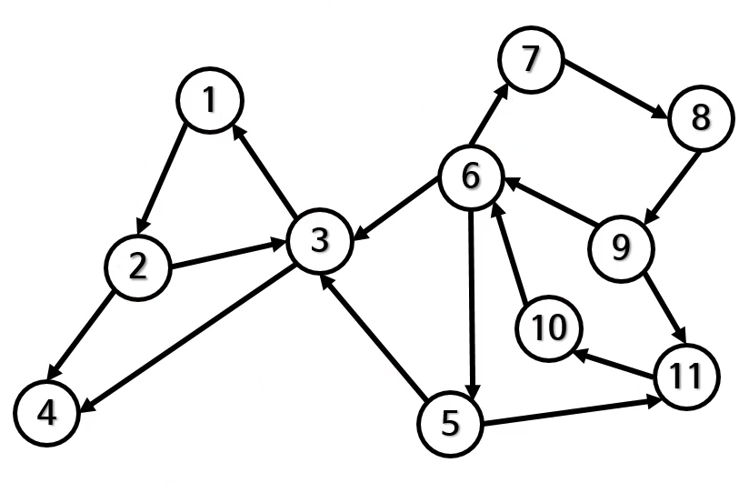
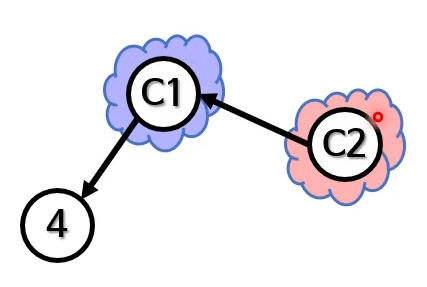

# 그래프 1


- 데이터들과 그 관계를 보여주는 방법 중 하나
- 서로 연관있는 노드의 집합
    - G = (N, E)
- 네트워크 형태의 관계를 보여주기에 적합
- 복잡한 실세계의 문제를 모델링하기에 적절
    - 네트워크 형태가 명백하게 안 보이는 경우도 있음
    - 그래프 이론을 적절히 적용하면 시간 복잡도를 확연히 줄일 수도 있음
    
#### 그래프 사용 예
- 지하철 노선도
- 교과 선수과목
- 전/현 직장동료
- 세탁기 사이클
- 스킬 트리(트리 : 방향 비순환 그래프 중 하나)

#### 관련 용어
- 노드(정점, 꼭지점)
- 변(간선, 선)
- 차수(degree)
- 루프(loop)

### 그래프 종류
- 방향/무방향 그래프
- 순환/비순환 그래프
- 가중/비가중 그래프

#### 방향 vs 무방향 그래프
- 방향 그래프(세탁기 사이클)
    - 변이 한 방향만 가리킴
    - 꼬리 -> 머리로 이동은 가능
    - 머리 -> 꼬리 이동은 불가능
- 무방향 그래프(인간 관계)
    - 변에 특별한 방향이 없음
    - 따라서 양방향을 가리키는 것과 같음
    - 꼬리 -> 머리, 머리 -> 꼬리 모두 가능
    
무방향 그래프의 최대 변 개수
- 모든 노드가 연결되어 있는 경우
    - 단, 평행 변이나 루프는 없음
- 첫 번째 노드의 변 : N - 1개
- 두 번째 노드의 변 : N - 2개
- 세 번째 노드의 변 : N - 3개

#### 순환 vs 비순환 그래프
- 비순환 그래프(교과 선수과목)
    - 일단 떠나면 그 노드로 돌아오는 경로가 없음
    - 그래프 안의 모든 노드에 대해
- 순환 그래프(지하철 노선)
    - 떠난 뒤에도 그 노드로 돌아오는 경로가 있음
    - 그런 노드가 하나만 있어도 순환 그래프
    
#### 가중 vs 비가중 그래프
- 비가중 그래프
    - 모든 변이 동일한 의미를 가짐
    - 각 변의 값이 같음
    - 별도의 표기 불필요
- 가중 그래프
    - 각 변의 관계 정도가 다름(예: 거리, 시간...)
    - 각 변의 값이 다름
    
### 그래프를 사용해 풀 수 있는 문제들
- 여러 스케줄링 관련
- 두 위치 사이의 여행 경로 관련
- 분자를 구성하는 원자들의 결합 관련
- 인터넷에서 데이터 패킷이 전달되는 경로 관련
- 대규모 프로젝트에서 일감 사이의 의존성 관련
- 도시의 전기 공급 그리드 관련
- SNS에서 친구 관계 관련

### 그래프의 다양한 표현 방법
#### 1. 원과 선
- 사람이 가장 이해하기 쉬운 표현법
- 한눈에 그래프를 파악 가능
- 단, 노드와 변의 수가 적당해야 함
```
public class Node{
    public int data;
    public ArrayList<Node> neighbors = new ArrayList<>();
}
```
#### 2. 인접 행렬(adjacency matrix)
- N x N 행렬
    - G[n][n]
    - N: 그래프 G안에 있는 노드 수
- 서로 인접한 노드를 표현
    - 인접: 두 노드 사이를 연결하는 변이 있음
    - i에서 j로 향하는 변이 있다면 G[i][j] = 1
    - 없으면 G[i][j] = 0
- G가 가중 그래프면 0/1 대신 실제 가중치를 저장
    


|---|A|B|C|D|
|---|---|---|---|---|
|A|0|1|1|0|
|B|1|0|1|1|
|C|1|1|0|0|
|D|0|1|0|0|


|---|A|B|C|D|
|---|---|---|---|---|
|A|0|0|1|0|
|B|1|0|0|1|
|C|0|1|0|0|
|D|0|0|0|0|

- 가로 방향 : 주체가 대상에 방향성이 있음
- 세로 방향 : 대상에 주체에게 방향성이 있음

장점
- 쉽게 구현 가능
- 변 제거의 시간 복잡도가 O(1)
- 다음과 같은 관계를 효율적으로 찾음
    - 노드 A에서 B로 가는 변이 존재하는가?
    - O(1)
    
단점
- 공간을 더 차지함 O(N^2)
- 언제나 같은 공간을 차지
    - 연결된 노드가 많아도/적어도
- 인접 행렬을 만드는 시간은 O(N^2)
- 인접 노드를 찾는 시간은 O(N)

#### 3. 인접 리스트(adjacency list)
- 각 노드마다 이웃의 리스트를 만듦
    - 리스트 N개
    - 보통 연결 리스트 N개를 배열에 저장
    - 연결 리스트 대신 다른 자료구조도 사용 가능
- 원과 선을 굳이 코드로 구현한 것과 큰 차이가 없음

장점
- 공간을 적게 사용
    - O(N + E)
    - 최악 : O(N^2) = O(N + N(N-1)/2)
- 삽입/삭제가 빠름
    - 연결 리스트를 사용했을 경우

단점
- 다음과 같은 관계를 찾는게 느림
    - 노드 A에서 B로 가는 변이 존재하는가?
    - O(1)보다 느림
    
#### 4. 기타 표현 방법
- 결합 행렬(incidence matrix)
- 결합 리스트(incidence list)
- ...

## 그래프의 깊이 우선 탐색

```
무한 루프
public static void searchDepthFirst(Node node){
    Stack<Node> stack = new Stack<>();
    stack.push(node);
    
    while(!stack.empty()){
        Node next = stack.pop();
        
        System.out.println(next.data);
        
        for(Node child : next.children){
            stack.push(child);
        }
    }
}
```

### 무한 루프 해결법
- 이미 처리했던 노드를 다시 처리하면 안됨
- 방문했던 노드를 기억할 방법이 필요
    - 전역적으로 방문했던 노드를 기억
    - 각 노드마다 방문했는지 여부를 기억
- 두 번째 방문시 처리 안 하고 곧바로 다음 노드로 넘어감

```
무한 루프 해결
public static void searchDepthFirst(Node node){
    HashSet<Node> visited = new HashSet<>();
    Stack<Node> stack = new Stack<>();
    stack.push(node);
    
    while(!stack.empty()){
        Node next = stack.pop();
        
        System.out.println(next.data);
        visited.add(next);
        for(Node neighbor : next.neighbors){
            if(!visited.contains(neighbor)){
               stack.push(neighbor);
            }
        }
    }
}

발견한 노드 기억하기
public static void searchDepthFirst(Node node){
    HashSet<Node> discovered = new HashSet<>();
    Stack<Node> stack = new Stack<>();
    stack.push(node);
    discovered.add(node);
    
    while(!stack.empty()){
        Node next = stack.pop();
        
        System.out.println(next.data);

        for(Node neighbor : next.neighbors){
            if(!discovered.contains(neighbor)){
               stack.push(neighbor);
               discovered.add(neighbor);
            }
        }
    }
}
```

## 위상정렬
- 그래프의 노드를 선형(일직선)으로 정렬하는 방법
- 우선순위가 바뀌지 않음
  - 예: B 노드를 가리키던 모든 노드들이 B 보다 전에 나옴
- DAG만 유효한 위상 정렬이 가능
  - 순환(cycle)하는 노드가 있다면 우선순위 판단이 불가능
  - 시작점이 존재해야 함
- 해답이 여럿일 수도 있음

예) DAG


위상 정렬


#### 위상 정렬 알고리즘
- DFS
- 칸 알고리즘
- 크게 두 가지 용도
  - 실제로 위상 정렬을 함
  - 위상 정렬 가능한 그래프인지 판단
  
### DFS를 사용한 위상 정렬
DFS만으로 간단히 위상 정렬을 할 수 있음

#### 물 받기부터 시작하는 전위 순회
1. 물 받기
2. 스프 넣기
3. 물 끓이기
4. 라면 넣기
5. 파 넣기
6. 2분 더 끓이기
7. 계란 넣기
8. 1분 더 끓이기
9. 먹기
10. 건더기 넣기
11. 라면 봉지 뜯기
12. 파 썰기
13. 수저 넣기

#### 물 받기부터 시작하는 후위 순회
1. 먹기
2. 1분 더 끓이기
3. 계란 넣기
4. 2분 더 끓이기
5. 파 넣기
6. 라면 넣기
7. 물 끓이기
8. 스프 넣기
9. 건더기 넣기
10. 물 받기
11. 라면 봉지 뜯기
12. 파 썰기
13. 수저 놓기

### 위상 정렬 용도
- 관계에서 순서를 정하는 매우 많은 곳에 사용 가능
  - 프로젝트 일정 만들기
  - CPU 명령어 실행 순서 결정
  - 스프레드 시트 셀 평가 순서 결정
  - 컴파일 순서 결정
  - DB 테이블 로딩 순서 결정
  - 선수 순위 결정
  
## 강한 결합 요소

- 송수관 깔기 문제
  - 자체적으로 식수를 조달하던 마을
  - 상류에 세운 새로운 댐 때문에 물길이 끊김
  - 다른 마을로부터 물을 받기로 결정
  - 이때 어디에 송수관을 연결해야 할까?
    - 당연히 적게 연결할수록 비용절감
    - 하지만 모든 집에 식수가 도달해야 함
  - 각 SCC를 한 노드로 생각하면 단순해짐
    - 그 중 한 노드에만 도달하면 되기 때문
  
  

세 노드의 관계 = 강한 결합 요소(1, 2, 3)
- 1에서 출발해서 다른 노드에 도착 가능
- 2에서 출발해서 다른 노드에 도착 가능
- 3에서 출발해서 다른 노드에 도착 가능
- 모든 노드가 직간접적으로 연결
  - 이걸 강한 결합 요소라고 함
  - Strongly Connected Component(SCC)
  


- 방향 그래프에서 끈끈한 관계를 가지는 노드들의 최대 그룹
  - 그 그룹에 속한 두 노드는 어떻게든 연결되어 있음
  - 반드시 이웃은 아님
- 정의
  - C ⊆ N
  - C에 속한 모든 정점 쌍 u, v에 대해 u -> v, v -> u인 가장 큰 집합
  
#### SCC의 주용도는 최적화
- 다른 알고리즘에서 고려해야 할 정점 수를 줄여줌
- 또 다른 예
  1. 그래프를 여러 SCC로 분리
  2. 각 SCC에 대해 알고리즘을 실행
  3. 그 결과를 합침
- 실행 문제를 풀기 위해 SCC를 사용하는 경우도 있음

### 위상 정렬과 SCC
- 순환 그래프는 위상 정렬이 불가능
- 순환하는 노드들은 SCC
- SCC로 치환한 그래프는 DAG
  - 이제 위상 정렬 가능
  - 각 존의 공사 순서를 결정할 수 있음
  
#### 강한 결합 요소 알고리즘
- DFS 기반 알고리즘
  - 코사라주 알고리즘
  - 타잔 알고리즘
  - 경로 기반 알고리즘
- 도달 가능성 기반 알고리즘(분할 정복)
