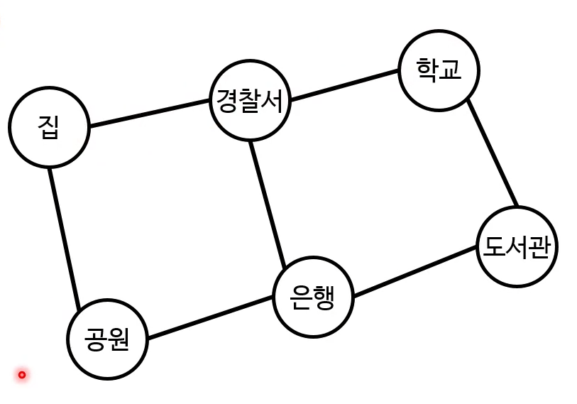
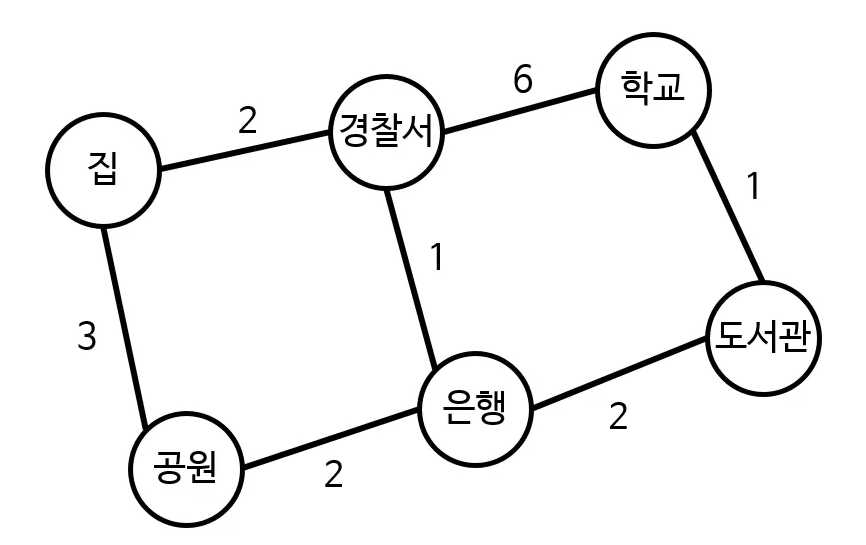
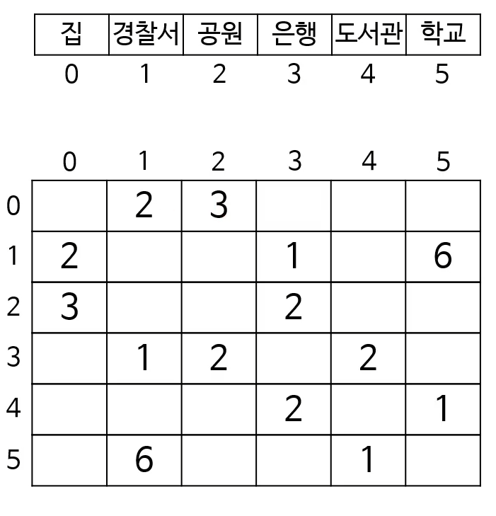

# 그래프 2

## 너비 우선 탐색
- 원래는 그래프에 사용 가능한 것
    - 트리는 특별한 제약이 있는 그래프
- 단, 방문한 노드를 기억해야 함
    - 실제로는 발견한 노드를 기억
    - 깊이 우선 탐색에서 이미 본 것
- 시간 복잡도 : O(N + E)
    
```
public static void searchBreadthFirst(Node node){
    HashSet<Node> discovered = new HashSet<>();
    Queue<Node> queue = new LinkedList<>();
    
    queue.add(node);
    discovered.add(node);
    
    while(!queue.isEmpth()){
        Node next = queue.remove();
        System.out.println(next.data + " ");
        
        for(Node neighbor : next.neighbors){
            if(!discovered.contains(neighbor)) {
                queue.add(neighbor);
                discovered.add(next);
            }
        }
    }
}
```

### 최단 경로 찾기(shortest path)

- 집에서 학교로 가는 길
- 각 변은 두 노드를 연결하는 도로를 의미
- 학교로 가는 경로는 여러 가지
- 사실 순환(cycle)이 있기네 경로는 무한
- 가장 간단한 방법은 주먹구구식
    - 모든 가능한 조합을 만든 뒤, 그중 가장 짧은 것을 선택
    - 단, 순환이 없게끔 해야함
- 하지만 이 방법은 엄청난 시간 복잡도
- BFS를 사용하면 최단 경로를 찾을 수 있음
    - 시간 복잡도도 O(N+E)
- 기본적인 BFS와 크게 다르지 않음
- 그러나 시작점부터 현재 노드까지의 거리를 기억해야 함
    - 거리 = BFS 깊이
- 저장법은 여러 가지
    - 해시 맵에 모든 노드의 거리를 저장
    - 2D 배열로 저장(인접 행렬과 비슷)
    - 각 노드 안에 거리를 저장(BFS를 실행하기 전에 리셋)

```
public static int findShortestDistance(Node s, Node d){
    HashMap<Node, Integer> distances = new HashMap<>();
    Queue<Node> queue = new LinkedList<>();
    
    queue.add(s);
    distances.put(s, 0);
    
    while(!queue.isEmpth()){
        Node next = queue.remove();
        int distance = distances.get(next);
        
        if(next.equals(d)){
            return distance;        
        }
        
        for(Node neighbor : next.neighbors){
            if(!distances.containsKey(neighbor)) {
                queue.add(neighbor);
                distances.put(neighbor, distance + 1);
            }
        }
    }
    
    return -1;
}
```

- 최종 노드부터 반대 방향으로 추적
- 추적을 위해 추가 정보 필요
    - 선행 노드 : '누가 나를 큐에 넣었는가?'
    - 큐에 다음 노드를 넣을 때 선행 노드도 같이 기재
- 정보 저장 방법은 여러 가지
    - 해시 맵에 기억
    - 노드 속에 선행 노드를 기억 (BFS 실행 전에 이 값을 리셋해줘야 함)
    - ...
    
## 다익스트라 알고리즘

- 두 노드 사이의 최단 경로를 찾음
- 방대한 노드 네트워크에 사용하기 충분히 빠름
- 변의 가중치가 음수인 경우에는 제대로 작동하지 않음
- 실세계에서 많이 사용
    - 지도/내비게이션
    - IP라우팅
    - 경유 항공편 찾기
    - ...
    
### 다익스트라 알고리즘의 기초
- 모든 노드를 한번씩 방문하며 아래의 연산을 함
    1. 아직 방문 안한 노드 중 가장 가까운 노드 n을 선택
    2. n의 각 이웃 노드 m으로 여행하는 거리를 계산(n의 거리 + n -> m의 거리)
    3. 이 결과가 m의 기존 거리보다 가까우면 m의 거리를 업데이트
- 모든 노드를 방문하면 최단 거리를 찾음
    - 모든 노드를 거쳐 온 경로 중 최솟값을 취했기 때문
    
### 알고리즘
1. 아직 방문 안 한 노드 중 가장 거리 값이 작은 노드 n을 선택
2. n의 가장 미방문 이웃 m으로 가는 더 짧은 경로가 있다면 업데이트
3. 다음 조건 중 하나를 만족하기 전까지 1~2를 반복
    - 모든 노드를 방문했음
    - n이 목적지임
4. 목적지까지의 거리/경로를 반환

#### 인접 행렬로 표현한 그래프


- 시간 복잡도 O((N + E) log N)
    - 방문하는 노드 수(= 알고리즘 실행 횟수) : N
        - 최소 거리 노드 선택 : log N
    - 모든 변을 한 번씩은 지나감 : E
        - 거리값 업데이트 : 1
    
#### 다익스트라와 음의 가중치
- 다익스트라는 음의 변이 있을 경우 오작동
    - 한 번 방문한 노드는 다시 방문 안하기 때문
- 변의 가중치가 언제나 양수라 가정한 알고리즘
    - 다음 거리는 언제나 이미 방문한 거리 이상
    
## A* 알고리즘
- 다익스트라와 기본은 같은 알고리즘
- 하지만 쓸데없는 평가를 피할 수 있음
- 예: 서울에서 부산 가기
  - 다익스트라 : 경부선, 호남선, 경인선, 경원선을 모두 탐색
  - A* : 경부선만 따라 쭉 달림
- 이를 위해 다음 노드 선택 시 기준을 하나 더 추가
  - 다익스트라의 기준은 시작점부터 노드까지의 거리
  - A*가 추가하는 기준은 그 노드로부터 목적지까지의 거리
  
#### 현재 노드부터 목적지까지의 거리
- 목적지까지 탐색을 다 하기 전까지는 확실히 모름
- 따라서 A*가 추가한 기준은 결정적이 아님!
  - 휴리스틱
  - 근사치
- 이 휴리스틱 함수에 따라 A*의 성능이 달라짐
- 대부분의 경우 다익스트라 보다 빠름
  - 실세계의 대표 경로 찾기 알고리즘이 A*인 이유
  - 하지만 데이터 따라 느릴 수도 있음

### A*의 두가지 노드 선택 기준
- g(n) : 시작 노드부터 노드 n까지의 거리(실제 값)
- h(n) : n부터 목적지 노드까지의 거리(추정치)
- f(n) : 시작 노드부터 목적지 노드까지의 거리(추정치)
  - f(n) = g(n) + h(n)
- 다음 노드 선택 시
  - 다익스트라는 g(n)이 최소인 것을 선택
  - A*는 f(n)이 최소인 것을 선택
  
#### A* h(n)
- 계속 목적지 방향으로 나아가고 싶음
  - 목적지 쪽에 있는 노드를 우선적으로 선택하고 싶음
  - 목적지 쪽에 있는 노드의 h(n)이 더 작아야 함
  - 목적지에 가까운 노드의 h(n)이 더 작아야 함
- 즉, h(n)은 거리 함수
  - 모든 상황에 최고인 함수는 없음
  - 상황에 따라 선택
    - ex) 유클리드 거리, 맨해튼 거리
  
#### 구현 시 다익스트라와의 차이점
- OPEN이란 이름의 노드 집합이 있음
  - 방문할 최단 경로 후보 노드들이 들어있음
- OPEN 안에 있는 후보 선택시 최소 f(n)을 이용
- 같은 노드를 두번 이상 방문할 수 있음

