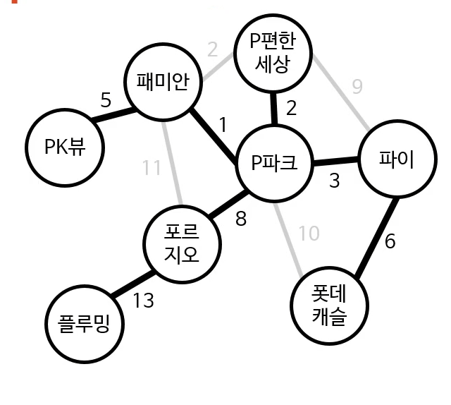
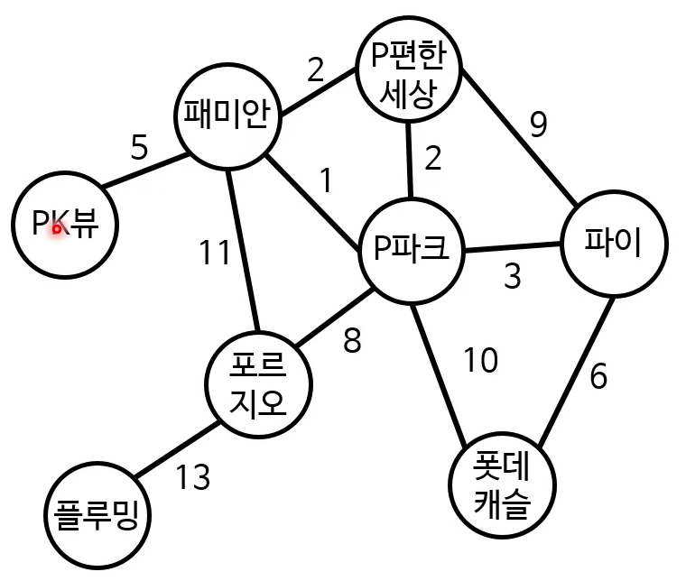
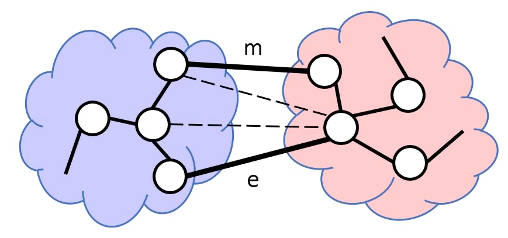
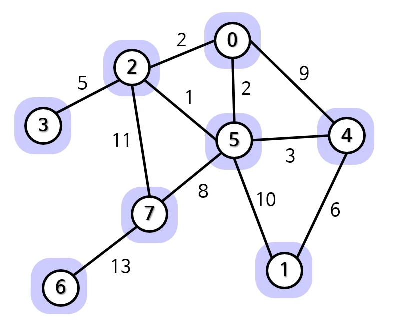

# 그래프 3

## 최소 신장 트리(MST)

- 줄여서 MST라고 함
- 신장 트리 중 비용이 최소인 트리
  - 비용 : 모든 변의 가중치를 합한 값
  - 최소 비용 신장 트리라고 함

광케이블 깔기 문제 분석
- 노드 : 아파트 빌딩
- 변 : 광선을 갈 수 있는 경로
- 변의 가중치 : 거리 = 설비 가격
- 목표
    - 모든 노드를 연결하는 변들 찾기
    - 단, 비용이 최소여야 함
  
#### 신장 트리(spanning tree)
- 어떤 그래프 안에 있는 모든 노드를 연결하는 트리
- 당연히 그래프 안에 있는 변만 사용해야 함
- 신장 트리는 여럿 있을 수 있음

### MST에서 사용하는 개념
- 순환(cycle)
  - 반복되는 노드가 시작 노드 끝 노드뿐인 경로
- 컷(cut)
  - 어떤 그래프를 서로소(disjoint)인 두 하위 집합으로 나누는 행위
  - 그래프의 노드들을 두 그룹으로 분리시키는 것
  - 컷 세트(cut-set) : 두 그룹을 연결하는 변들의 집합
- cut property
  - 컷 세트에 가중치가 다른 여러 변이 있는 경우
    - 즉, 가중 그래프임을 가정
  - MST에 포함되는 변은 가장 가중치가 작은 변
  

### MST 알고리즘의 기본 원리
1. 그래프에 있는 노드 중 한 변을 확인
2. 이 변이 MST에 들어가야 하는지 검사
    - 이때, cut property를 사용
    - 들어가야 하면 MST에 추가, 아니면 무시
3. MST의 모든 변을 찾지 못했다면 1로 돌아감

#### 크러스컬 알고리즘
1. 그래프의 각 노드마다 그 노드만 포함하는 트리를 만듦

2. 모든 변을 가중치의 오름차순으로 정렬 -> S배열
[1, 2, 2, 3, 5, 6, 8, 9, 10, 11, 13]
3. S가 비거나 MST가 완성될 때까지의 다음의 과정을 반복
[1, 2, 3, 5, 6, 8, 13]
    1) S에서 가중치가 가장 적은 변을 제거해서 고려
    2) 이 변이 두 트리를 연결하는지 검사
        - 그렇다면 MST에 추가
        - 아니면 버림

### 서로소 집합 자료 구조
- 합집합 찾기 자료 구조라고도 함
- 겹치지 않는 집합들을 저장하는 자료 구조
- 서로 다른 트리는 겹치지 않는 집합
-이걸 서로소 집합에 저장하면 간단한 연산만으로 겹치는지 알 수 있음
  
#### disjoint-set 연산
- MakeSet : 새로운 집합을 만듦
    - element는 당연히 새로운 요소
- Find(element) : element가 속한 집합을 찾음
    - Find(x) == Find(y) : 둘이 같은 집합에 속함
    - Find(x) != Find(y) : 둘이 다른 집합에 속함
    - 가장 간단한 구현 : 그 집합에 속한 요소 중 하나를 결정론적으로 반환
- Union(element1, element2) : 두 집합을 합침
    - element1이 속한 집합 + element2가 속한 집합
    
#### disjoint-set을 사용한 크러스컬 알고리즘
1. 그래프에 있는 각 노드 N에 대해 MakeSet(N)
2. 모든 변을 가중치의 오름차순으로 정렬 (S배열)
3. S가 비거나 MST가 완성될 때까지 다음의 과정을 반복
    1) S에서 가중치가 가장 적은 변을 제거
    2) 이 변이 연결하는 두 노드 v, u에 대해 Find(u) ≠ Find(v)면
        - Union(u, v)
        - 이 변을 MST에 추가

#### 크러스컬 알고리즘의 시간 복잡도
- 변 정렬 : O(E log E)
- 나머지 복잡도는 disjoint-set의 시간 복잡도에 따라 결정
    - 최적화된 disjoint-set 알고리즘이 존재
- 최종 시간 복잡도
    - O(E log E) = O(E log V)
    
**프림 알고리즘(참고)**
1. 아무 노드나 하나 골라서 트리를 하나 만듦
2. 이 트리를 성장시킬 수 있는 변을 하나 고름
    - 아직 트리에 속하지 않은 노드와 연결하는 변 중 비용이 가장 적은 변
    - 이미 트리에 속해 있는 노드와 연결하는 변이면 무시
3. MST가 완성 되거나 더 이상 고려할 변이 없을 때까지 2번을 반복

