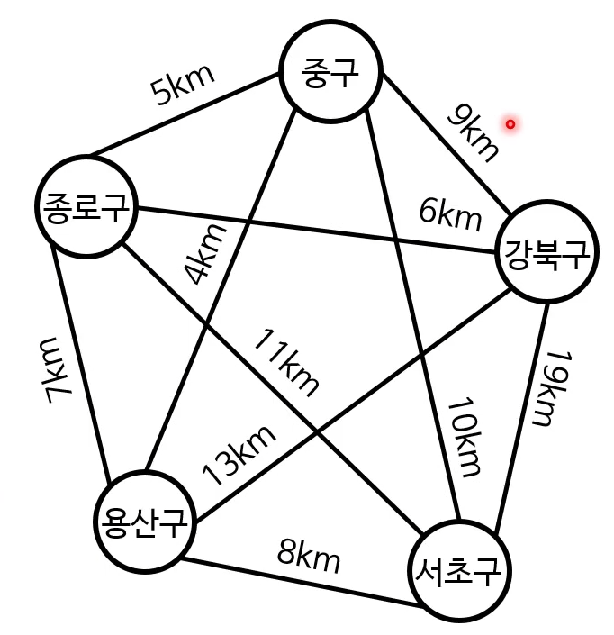
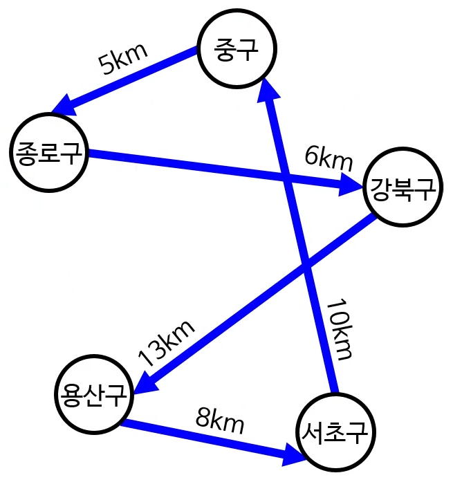

# 그래프 3

## 최소 신장 트리(MST)

- 줄여서 MST라고 함
- 신장 트리 중 비용이 최소인 트리
  - 비용 : 모든 변의 가중치를 합한 값
  - 최소 비용 신장 트리라고 함

광케이블 깔기 문제 분석
- 노드 : 아파트 빌딩
- 변 : 광선을 갈 수 있는 경로
- 변의 가중치 : 거리 = 설비 가격
- 목표
    - 모든 노드를 연결하는 변들 찾기
    - 단, 비용이 최소여야 함
  
#### 신장 트리(spanning tree)
- 어떤 그래프 안에 있는 모든 노드를 연결하는 트리
- 당연히 그래프 안에 있는 변만 사용해야 함
- 신장 트리는 여럿 있을 수 있음

### MST에서 사용하는 개념
- 순환(cycle)
  - 반복되는 노드가 시작 노드 끝 노드뿐인 경로
- 컷(cut)
  - 어떤 그래프를 서로소(disjoint)인 두 하위 집합으로 나누는 행위
  - 그래프의 노드들을 두 그룹으로 분리시키는 것
  - 컷 세트(cut-set) : 두 그룹을 연결하는 변들의 집합
- cut property
  - 컷 세트에 가중치가 다른 여러 변이 있는 경우
    - 즉, 가중 그래프임을 가정
  - MST에 포함되는 변은 가장 가중치가 작은 변
  

### MST 알고리즘의 기본 원리
1. 그래프에 있는 노드 중 한 변을 확인
2. 이 변이 MST에 들어가야 하는지 검사
    - 이때, cut property를 사용
    - 들어가야 하면 MST에 추가, 아니면 무시
3. MST의 모든 변을 찾지 못했다면 1로 돌아감

#### 크러스컬 알고리즘
1. 그래프의 각 노드마다 그 노드만 포함하는 트리를 만듦

2. 모든 변을 가중치의 오름차순으로 정렬 -> S배열
[1, 2, 2, 3, 5, 6, 8, 9, 10, 11, 13]
3. S가 비거나 MST가 완성될 때까지의 다음의 과정을 반복
[1, 2, 3, 5, 6, 8, 13]
    1) S에서 가중치가 가장 적은 변을 제거해서 고려
    2) 이 변이 두 트리를 연결하는지 검사
        - 그렇다면 MST에 추가
        - 아니면 버림

### 서로소 집합 자료 구조
- 합집합 찾기 자료 구조라고도 함
- 겹치지 않는 집합들을 저장하는 자료 구조
- 서로 다른 트리는 겹치지 않는 집합
-이걸 서로소 집합에 저장하면 간단한 연산만으로 겹치는지 알 수 있음
  
#### disjoint-set 연산
- MakeSet : 새로운 집합을 만듦
    - element는 당연히 새로운 요소
- Find(element) : element가 속한 집합을 찾음
    - Find(x) == Find(y) : 둘이 같은 집합에 속함
    - Find(x) != Find(y) : 둘이 다른 집합에 속함
    - 가장 간단한 구현 : 그 집합에 속한 요소 중 하나를 결정론적으로 반환
- Union(element1, element2) : 두 집합을 합침
    - element1이 속한 집합 + element2가 속한 집합
    
#### disjoint-set을 사용한 크러스컬 알고리즘
1. 그래프에 있는 각 노드 N에 대해 MakeSet(N)
2. 모든 변을 가중치의 오름차순으로 정렬 (S배열)
3. S가 비거나 MST가 완성될 때까지 다음의 과정을 반복
    1) S에서 가중치가 가장 적은 변을 제거
    2) 이 변이 연결하는 두 노드 v, u에 대해 Find(u) ≠ Find(v)면
        - Union(u, v)
        - 이 변을 MST에 추가

#### 크러스컬 알고리즘의 시간 복잡도
- 변 정렬 : O(E log E)
- 나머지 복잡도는 disjoint-set의 시간 복잡도에 따라 결정
    - 최적화된 disjoint-set 알고리즘이 존재
- 최종 시간 복잡도
    - O(E log E) = O(E log V)
    
**프림 알고리즘(참고)**
1. 아무 노드나 하나 골라서 트리를 하나 만듦
2. 이 트리를 성장시킬 수 있는 변을 하나 고름
    - 아직 트리에 속하지 않은 노드와 연결하는 변 중 비용이 가장 적은 변
    - 이미 트리에 속해 있는 노드와 연결하는 변이면 무시
3. MST가 완성 되거나 더 이상 고려할 변이 없을 때까지 2번을 반복

## 외판원 문제(traveling salesman problem)
- 줄여서 TSP라고 부름
- 여러 도시를 방문해야 하는 외판원
- 각 도시를 최소 한 번씩 방문해야 함
- 가장 짧은 거리를 이동해서 다음을 완료해야 함
    - 한 도시에서 시작
    - 모든 도시를 방문
    - 원래 도시로 돌아옴
    - 이동 방법은 운전
- 이동 거리를 최소화하는 문제
- 한번 방문한 노드는 재방문 안 하는게 좋음
- 방문 순서도 중요

### TSP 알고리즘의 시간 복잡도
- 주먹구구식 알고리즘 : O(N!)
    - 20개 노드만 돼도 거의 사용 불가능
    - O(20!) = 2.43 * 10^18
- 헬드-카프(Help-Karp) 알고리즘 : O(N^2 * 2^N)
    - 동적 계획법
    - 공간 복잡도 : O(2^N * N)

### TSP 근사 알고리즘
- 따라서 TSP는 보통 근사 알고리즘으로 해결
- 다양한 근사 알고리즘이 존재
    - 특정 조건을 만족하는 그래프에만 적합한 알고리즘
    - 실제 최소 비용보다 최대 K배까지 허용하는 알고리즘
    - 주사위를 굴리는 알고리즘
    - ...
    
#### 우리가 볼 TSP 그래프
- 무방향 그래프
- 완전(complete) 그래프
    - 모든 정점 쌍이 딱 한 번씩만 연결되어 있음
    - 루트 없음
- 변의 가중치는 음수가 아님
- 변의 가중치는 삼각 부등식을 만족

#### 삼각 부등식(triangle inequality)
- 삼각형의 세 변에 관한 부등식
    - 제일 긴 변보다 나머지 두변의 합이 큼
    - 유클리드 기하학에서는 무조건 성립
- TSP와 삼각 부등식
    - 비용 함수 c가 부등식을 만족
        - c(u, w) ≤ c(u, v) + c(v, w)
        - 무조건 중간점 v를 생략하는 게 최소 비용을 보장
    - 공간에 대한 TSP(유클리드 TSP)면 만족
    - 다른 많은 TSP 문제에서도 만족
    - 삼각 부등식을 만족해도 NP-완전 문제
    
#### 2-근사 알고리즘

- 아무리 커도 최소 비용보다 2배인 경로를 찾음
    - 참고 : k배인 근사 알고리즘은 k-근사 알고리즘이라 함
- 삼각 부등식을 만족하는 TSP에 사용 가능

1. MST를 만듦
    - TSP 경로 비용의 하한
    - 중간에 끊어진 노드가 없기에 언제나 만들 수 있음
    - 크러스컬 이용시 O(E log V)
2. MST를 그냥 한 바퀴 돎
    - 아무리 느려도 각 변을 2번 방문하는게 끝
    - 이미 방문한 노드는 건너뜀(완전 그래프기에 가능)
    - 그 한 반퀴 도는 경로가 해밀턴 순환
    1) MST의 노드를 DFS로 전위 순회하며 목록에 저장
    2) 저장된 노드를 차례로 방문하며 해밀턴 순환 H를 만듦
        - 첫 방문인 경우, H에 추가
        - 이전에 방문했었다면, 무시
    

#### 2-근사 TSP 알고리즘의 시간 복잡도
- MST의 시간 복잡도 + O(N)

#### TSP 알고리즘의 실제 사용례
- 여러 장소 방문 문제
    - 학교 버스 경로 계산
    - 서비스 기사 방문 순서 계싼
    - 배달 경로 계산
- 효율적인 공정 계획(예 : 회로 기판에 구멍 뚫는 순서)
- DNA 염기서열 분석
- 엑스선 결정학 분야에서의 결정구조 해석
- ...
